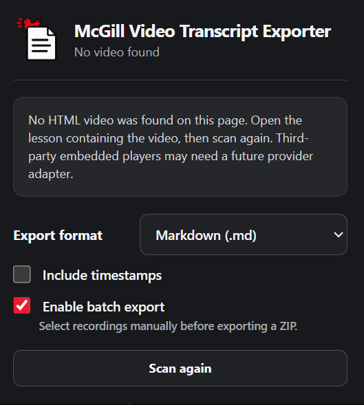
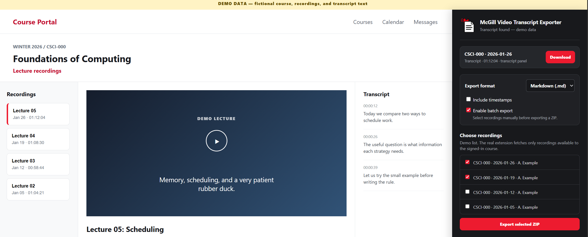

# McGill Video Transcript Exporter

<p align="center">
  
</p>

A small Chrome/Edge Manifest V3 extension that exports captions already available to the signed-in student as Markdown, plain text, or WebVTT. It supports native Brightspace media and McGill Lecture Recording System transcript panels.

> Unofficial project. It is not affiliated with, endorsed by, or supported by McGill University, D2L, Brightspace, or McGill's Lecture Recording System.

## What it does

- Scans the current page and accessible frames only after you click the extension.
- Finds native `<video>`/`<audio>` caption tracks, including media inside open shadow roots.
- Reads browser `TextTrack` cues or fetches an attached VTT/SRT caption file with the page's existing session.
- Chooses the playing or most visible media first.
- Lets you review and explicitly download every transcript; it never downloads on scan.
- Lists each language/track when several are available.
- On McGill Lecture Recordings pages, can package selected recordings' existing VTT caption files into one ZIP file without driving the LRS player UI.
- Never asks for a Brightspace password or sends transcript data to a server.

The extension exports existing captions. It does not transcribe audio and does not bypass course or media permissions.

## Demo screenshot

### Empty state



### Batch export



The batch screenshot comes from [`demo/index.html`](demo/index.html), a standalone, screenshot-ready interface mock. It uses fictional course names, recordings, instructor names, video imagery, and transcript text; it does not connect to Brightspace, McGill LRS, or any account.

## Install locally

1. Open `chrome://extensions` in Chrome, or `edge://extensions` in Edge.
2. Turn on **Developer mode**.
3. Choose **Load unpacked**.
4. Select this project folder.
5. Pin **McGill Video Transcript Exporter** to the toolbar.

After changing project files, click the extension's **Reload** button on the extensions page and refresh the course page.

## Use

1. Open a Brightspace lesson containing a video and wait for the player to load.
2. Click the extension icon.
3. Select the export format and click the desired track's **Download** button.

### McGill Lecture Recordings

McGill's recording tool displays captions in a transcript sidebar hosted by `lrs.mcgill.ca`; it does not attach captions to the video as a browser text track. The extension has narrowly scoped access to `https://lrs.mcgill.ca/*` so it can read that already-visible transcript panel and export it. Reload the extension after updates, then refresh the recording page before testing.

If the player is visible but nothing is found, turn captions on or open **Settings → View transcript** in the Brightspace player and click **Scan again**.

Batch export is available by default. After reloading the Lecture Recordings page, choose **Batch export course recordings**, select recordings, and explicitly press the ZIP export button. The extension observes the temporary LRS authorization header already sent by your signed-in browser, keeps it only in memory, and asks McGill's LRS API for the existing recording list and VTT caption files. It does not click recordings, play videos, persist the token, or send it to any third party. Recordings without an available transcript are skipped and reported. Single and batch export filenames use the LRS course code and recording date when LRS provides them.

## Permissions and privacy

The extension is designed to process content locally in the browser.

| Permission | Why it is needed |
| --- | --- |
| `activeTab` | Lets the extension inspect only the tab where the user clicked its icon. |
| `scripting` | Lets it inspect the page's media, caption tracks, and transcript DOM. |
| `downloads` | Saves the selected Markdown, TXT, or VTT file to the user's Downloads folder. |
| `https://lrs.mcgill.ca/*` | Lets the McGill adapter inspect the embedded Lecture Recording System frame where its transcript sidebar is rendered. |
| `webRequest` + `https://lrswapi.campus.mcgill.ca/*` | Observes the signed-in browser's existing temporary LRS authorization header so batch export can request the same course's recording metadata and VTT captions directly from McGill. The token stays only in service-worker memory. |

The extension does **not**:

- send transcript text, URLs, credentials, cookies, or analytics to a server;
- ask for or store a Brightspace password;
- persist LRS authorization tokens;
- read arbitrary browsing history;
- bypass course access, authentication, DRM, or download restrictions;
- generate a transcript for a video that has no captions.

## Responsible-use rules

Use this extension only for recordings and transcripts you are authorized to access through your own Brightspace account.

- Follow your university's acceptable-use rules, course policies, and applicable copyright terms.
- Treat exported transcripts as course material. Do not publicly repost, sell, or redistribute them without permission from the instructor or rights holder.
- Review auto-generated captions before relying on them for quotations, accessibility work, or academic submissions; caption text may contain errors.
- Do not modify the extension to bypass access controls or extract content that is not visible to the signed-in user.

## Support and warnings

| Situation | Expected behavior |
| --- | --- |
| Brightspace video with a VTT/SRT caption track | Exports the track. |
| McGill LRS recording with transcript sidebar | Exports the visible transcript rows and timestamps. |
| Video without captions/transcript | Reports that no readable transcript was found. |
| Panopto, Kaltura, YouTube, Vimeo, or another external player | May require a dedicated adapter. |
| Player markup changes | The relevant adapter may need an update. |

## Test

Run the dependency-free parser test with Node.js:

```powershell
node tests/transcript.test.js
```

## Current limitations

- A video must already have captions. Missing captions require a separate speech-to-text feature.
- Cross-origin third-party players such as Panopto, Kaltura, YouTube, or Vimeo may need provider-specific adapters and optional host permission.
- Closed shadow roots and DRM-protected media cannot be inspected.
- Brightspace deployments can differ. Testing against a real, authorized course page is required before considering the extractor production-ready.

## Development

Run the parser test after changes:

```powershell
node tests/transcript.test.js
```

The extension contains two extraction strategies:

- Native media: reads browser caption tracks or attached VTT/SRT files.
- McGill LRS: reads the transcript rows already rendered in the `lrs.mcgill.ca` embedded frame.
